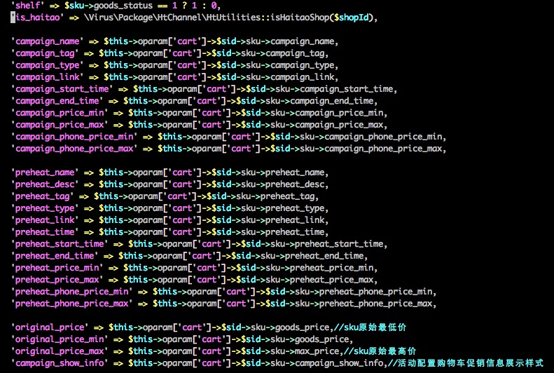
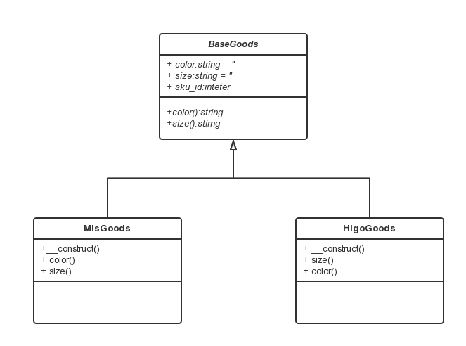
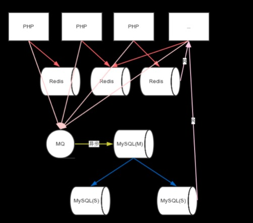
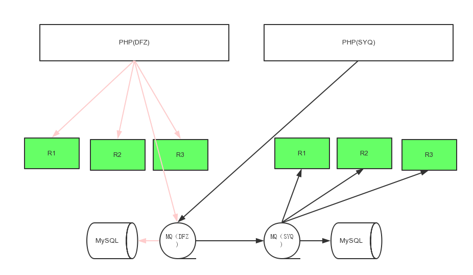
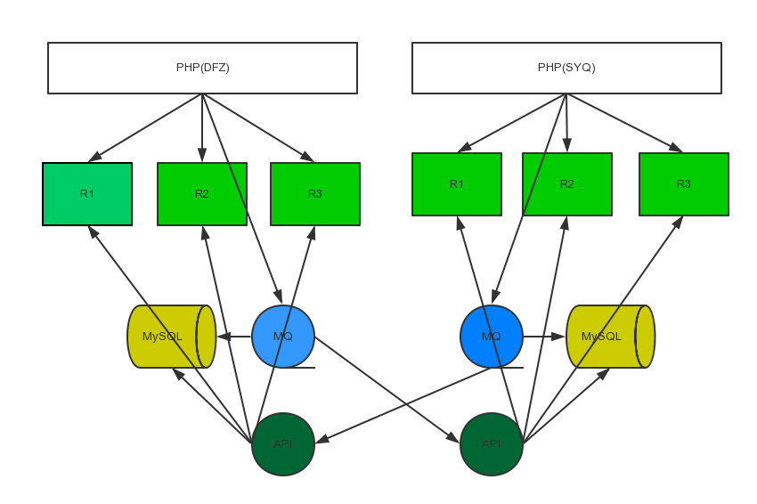
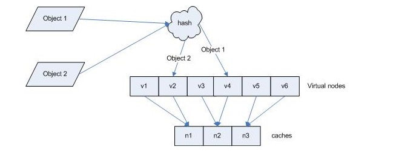

# 购物车前期调研

## 1，系统边界

从用户视角来看，购物车模块包括增删改查购物车记录。从功能视角来看，购物车模块是一个用户预购买商品的暂存地，整合了支撑交易功能的底层服务，服务包括商品，满额满件，优惠券。另外购物车还为下单提供了必要的数据。

## 2，依赖和被依赖关系

### 1,依赖
- **同商品的依赖关系**：购物车列表和商品的依赖是最紧密的，以至于在购物车的数据读取类里面直接嵌入了商品数据读取的代码。根据sku_id向商品模块读取sku的详细信息，包括价格，商品名称，库存等。

- **同满额满件的依赖关系**：加载完购物车的主信息（包括商品信息）后，会根据shop_id获取商家设置的满额满件的数据。

- **同优惠券的依赖关系**：根据用户id和购物车商品所属店铺id获取商家所设置的店铺优惠券数据。

- **同店铺的依赖关系**：根据shop_id获取店铺的详细数据。

### 2,被依赖
- **同下单的依赖关系**：购物车下单时会用到购物车的数据，购物车主表里面的每一条记录（以sid为主键的一条记录）表示一个sku，在订单确认页面或提交订单都会根据sid来获取商品的价格，库存，上下架等数据（实际上，会根据sid再去商品系统取一下数据）。下单完成后，系统会删除掉使用到的sid记录。

- **同登录的依赖关系**：用户登录时，会向购物车模块发送合并购物车请求。在登录请求的finally阶段，不会影响登录流程的进行。

- **同统计的依赖关系**：加车时，前端会传过来一个参数:pid，记录的是用户加车之前的动作，BI会异步读取分析数据来分析用户行为。

- **同消息推送的依赖关系**：一周前加入购物车的商品如果降价了，则推送消息

## 3,当前模块层次关系

> 整个交易系统的架构是两层结构(sdoota & vdoota), sdoota层的主要作用是发送请求和为各平台（pc & mob）组装数据，vdoota层的主要作用是处理各模块的逻辑和提供数据。

<center></center>
<center>图3-1：购物车列表层次结构图</center>
   
  
从购物车列表的层次图中可以看出，vdoota的购物车列表接囗调用了满额满件模块和购物车的主表数据，其中购物车的主表数据内嵌了商品数据的获取逻辑。另外一个和vdoota同层的coupon层提供了优惠券数据。


<center></center>
<center>图3-2：购物车下单层次结构图</center>

购物车下单的过程中，订单模块会向购物车获取获取下单商品的详细信息，下单成功后删除相应的购物车记录。

## 4,当前业务逻辑流程


- **购物车列表**：如果是已登录用户，从cart.t_bat_shopcart读取用户的购物车数据，未登录读取cart.t_bat_shopcart_offline，然后根据主表数据获取sku和shop的详细数据。遍历用户购物车的每条记录并格式化数据，sku中的数据包括了价格，库存，标题和活动的相关数据。购物车的主要数据加载完成后，根据shop_id获取商家设置的满额满件优惠数据。vdoota层处理完成，把这些数据返回给sdoota。sdoota接收到数据后，向coupon模块发送http请求获取店铺的可领取的店铺优惠券，格式化数据后向hornbill输出数据。(取满额满件，优惠券的具体逻辑todo)

- **向购物车添加商品**：系统首先加载添加商品的sku信息和用户所有的购物车数据，进行入库前的各项检查：上下架，商品属性（颜色尺码）合法性，库存，用户最多可加入的商品数等（相同商品一次只能有100件，购物车最多能有100种sku）。如果用户已经有相同sku商品，则更新amount，否则插入数据。

- **删除购物车商品**：根据sid（购物车每条记录主键）将对应的记录statu设置为-1。

- **更新购物车商品**：系统判断更新后的sku属性购物车里是否存在，如存在则删除更新的sku记录并返回，如不存在则更新相关的数据。

- **更新购物车sku数量**：更新购物车sku数量的参数是：sid_amount，amount是表示要更新到的sku数量，所以如果有两个客户端同时操作加或减，都会以最后执行操作所看到的那个结果为准。

- **获取优惠券提醒**：更新购物车商品和数量的时候，会调用获取购物车店铺优惠券的接囗。取到店铺优惠券数据后，过滤掉不满足条件的记录，组装数据后向hornbill输出数据。

- **订单确认**：购物车在订单确认所起的作用就是读取商品数据。

- **下单**：购物车在订单所起的作用除了读取商品数据外，在下单成功后还需要删除所对应的记录。

- **脚本推荐**： 一周前加入购物车的商品如果降价了，则推送消息

- **购物车合并**：用户未登录状态下向购物车加入的商品存放在cart.t_bat_shopcart_offline，用户登录后会把这个表里的数据同步到线上表cart.t_bat_shopcart。逻辑是遍历线下购物车，如有和线上sku数据相同的商品，则完全覆盖（sku数量以线下购物车数量为准）。合并完成后，删除线下数据库表的数据。

## 5,产品现状和规划(todo)

运营对购物车的要求是能灵活的控制购物车中商品的容量。产品对购物车的定位是暂存商品和促进交易。其中暂存交易包括了更方便的去修改购物车中商品的数量，属性等信息；促进交易主要包括购物车中的商品提供优惠券，满额满件的一些类似的优惠推荐。未来可能要加上商家的一些促销语，保障信息等能增加用户购买欲望的一些提示。产品对目前购物车优惠的建议是考虑到满件的优惠是可以选择商品的，希望为每一个商品出一份满额满件的优惠提示。
## 6,当前线上部署、流量、数据量和性能情况（含大促期间 todo）
- **1.当前线上部署情况**:
    nginx:
    		sdoota 
					pc:dfz-nx-01 dfz-nx-02
					mob:dfz-wannx-01 dfz-wannx-02
			vdoota
					dfz-nx-01 dfz-nx-02
		fast-cgi:nginx配置
			sdoota 
					pc:dfz-nx-01 dfz-nx-02
					mob:dfz-wannx-01 dfz-wannx-02

				    server 10.5.1.65:9996 weight=164 max_fails=3 fail_timeout=10s; #dfz-dootafe-04
					server 10.5.1.69:9996 weight=164 max_fails=3 fail_timeout=10s; #dfz-dootafe-05
					server 10.5.1.71:9996 weight=164 max_fails=3 fail_timeout=10s; #dfz-dootafe-06
					server 10.5.0.105:9996 weight=144 max_fails=3 fail_timeout=10s; #dfz-dootafe-07
					server 10.5.1.87:9996 weight=144 max_fails=3 fail_timeout=10s; #dfz-dootafe-08
					server 10.5.1.91:9996 weight=144 max_fails=3 fail_timeout=10s; #dfz-dootafe-09
					server 10.5.2.37:9996 weight=164 max_fails=3 fail_timeout=10s; #dfz-dootafe-10
					server 10.5.2.51:9996 weight=164 max_fails=3 fail_timeout=10s; #dfz-dootafe-11
					server 10.5.2.53:9996 weight=164 max_fails=3 fail_timeout=10s; #dfz-dootafe-12
					server 10.5.2.55:9996 weight=164 max_fails=3 fail_timeout=10s; #dfz-dootafe-13
					server 10.5.2.57:9996 weight=164 max_fails=3 fail_timeout=10s; #dfz-dootafe-14
					server 10.5.2.59:9996 weight=164 max_fails=3 fail_timeout=10s; #dfz-dootafe-15

			vdoota
					dfz-nx-01 dfz-nx-02

					server 10.5.2.61:9096 weight=164 max_fails=3 fail_timeout=10s; #dfz-dootafe-16
					server 10.5.2.63:9096 weight=164 max_fails=3 fail_timeout=10s; #dfz-dootafe-17
					server 10.5.2.65:9096 weight=144 max_fails=3 fail_timeout=10s; #dfz-dootafe-18
					server 10.5.5.27:9096 weight=164 max_fails=3 fail_timeout=10s; #dfz-dootafe-19
					server 10.5.5.37:9096 weight=164 max_fails=3 fail_timeout=10s; #dfz-dootafe-20
					server 10.5.5.41:9096 weight=164 max_fails=3 fail_timeout=10s; #dfz-dootafe-21
					server 10.5.5.43:9096 weight=164 max_fails=3 fail_timeout=10s; #dfz-dootafe-22
					server 10.5.3.35:9096 weight=164 max_fails=3 fail_timeout=10s; #dfz-dootafe-23
					server 10.5.3.37:9096 weight=164 max_fails=3 fail_timeout=10s; #dfz-dootafe-24
					server 10.5.3.39:9096 weight=164 max_fails=3 fail_timeout=10s; #dfz-dootafe-25
					server 10.5.3.43:9096 weight=164 max_fails=3 fail_timeout=10s; #dfz-dootafe-26
					server 10.5.3.45:9096 weight=164 max_fails=3 fail_timeout=10s; #dfz-dootafe-27
					server 10.5.1.15:9096 weight=164 max_fails=3 fail_timeout=10s; #dfz-dootafe-28
					server 10.5.1.18:9096 weight=164 max_fails=3 fail_timeout=10s; #dfz-dootafe-29
		db:
			db=cart host=10.5.1.33 port=3323 master=1
			db=cart host=10.5.1.37 port=3323 master=0
		    db=cart host=10.5.2.41 port=3323 master=0

- **流量：各接口（白天平均／高峰）的qps **:
    接口统计：
    	snake mob:
    		Cart_add    购物车添加商品
			Cart_list   购物车列表
			Cart_number 购物车商品数量
			Cart_remove 删除购物车商品
			Cart_statistic （已废弃，部分版本在用）
			Cart_update 更新购物车商品数量
		snake pc:
			Add 向购物车添加商品 dootaapi
			Add_result 加入购物车后的结果界面（取购物车数据）
			Batch_add  搭配秀商品添加到购物车
			Get_coupon_remind 更新购物车商品数量时调用的优惠券提醒（不过貌似不可用，待确认）
			Goods_prop 获取单品属性
			List_info  购物车列表
			Mz_check 判断加入购物车的商品是不是美妆特卖商品
			Number 购物车数量
			Remove 移除购物车商品
			Statistic 购物车数量统计（含海淘)
			Update 更新购物车数量
			Update_prop 更新购物车商品属性
			coupon/coupon_cart_promotion 商品加入购物车后界面的优惠券推荐
		vdoota:
			order/shopping_cart_add 添加购物车主接囗
			order/shopping_cart_add_multi 商品批量加入购物车（搭配购）
			order/shopping_cart_get 获取购物车特定记录数据
			order/addr_query 查询地址（mob计算包邮计算使用）
			order/shopping_cart_verify 验证用户购物车数据（get_coupon_remind使用）
			order/shopping_cart_banner 获取购物车banner
			order/shopping_cart_poster 获取购物车主数据（包括满额满件）
			order/shopping_cart_offshelf 已废弃
			order/mz_check 
			order/shopping_cart_number 获取购物车数量
			order/shopping_cart_remove 删除购物车商品
			order/shopping_cart_update 更新购物车数量
			order/shopping_cart_edit 更新购物车商品属性
			coupon/batch_get_shop_coupon_apply 批量获取店铺优惠券
			coupon/search_coupon get_coupon_remind使用
			coupon/batch_get_coupon_meta  get_coupon_remind使用
			freight/get_charge 获取运费
- **性能：各接口平均响应耗时，压测极限性能**:
	见pages附件
- **大促期间增长情况：515大促各接口流量增长**
	
- **耗时分布：耗时分层分布**
   
    ```
20点mob的购物车列表数据
    name:cart_list total_amount:37099 TotalAvgTime:0.308
	 0~50ms: 	 amount:2054	 avgTime:0.027
	 50~100ms: 	 amount:1039	 avgTime:0.089
	 100~150ms: 	 amount:7523	 avgTime:0.128
	 150~300ms: 	 amount:13734	 avgTime:0.211
	 300~500ms: 	 amount:6007	 avgTime:0.385
	 500~1000ms: 	 amount:6045	 avgTime:0.679
	>1000ms: 	 amount:697	 avgTime:1.42	

	同时间段优惠券接囗性能数据

	name:coupon_batch_get_shop_coupon_apply total_amount:36654 TotalAvgTime:0.053
	 0~50ms: 	 amount:23591	 avgTime:0.029
	 50~100ms: 	 amount:8051	 avgTime:0.071
	 100~150ms: 	 amount:3591	 avgTime:0.123
	 150~300ms: 	 amount:1418	 avgTime:0.176
	 300~500ms: 	 amount:3	 avgTime:0.388

	同时间段的virusdoota
	name:order_shopping_cart_poster total_amount:44245 TotalAvgTime:0.174
	 0~50ms: 	 amount:12952	 avgTime:0.029
	 50~100ms: 	 amount:10325	 avgTime:0.073
	 100~150ms: 	 amount:5366	 avgTime:0.123
	 150~300ms: 	 amount:7619	 avgTime:0.215
	 300~500ms: 	 amount:5250	 avgTime:0.396
	 500~1000ms: 	 amount:2256	 avgTime:0.625
	 >1000ms: 	 amount:477	 avgTime:1.696	
```

	通过在线上机器记录日志
	购物车列表一共有三个请求，统计数据发现购物车主信息（包括满额满件）占用了~60%，优惠券和运费的各占用了~20%。发现shopping_cart_poster数据主要消耗在商品信息的获取阶段（brd_goods）~80%

	```
	20点加购物车数据
	name:cart_add  total_amount:15279 TotalAvgTime:0.251
	 0~50ms: 	 amount:40	 avgTime:0.044
	 50~100ms: 	 amount:3899	 avgTime:0.078
	 100~150ms: 	 amount:2760	 avgTime:0.124
	 150~300ms: 	 amount:4132	 avgTime:0.214
	 300~500ms: 	 amount:2708	 avgTime:0.391
	 500~1000ms: 	 amount:1540	 avgTime:0.664
	 >1000ms: 	 amount:200	 avgTime:1.1

	对应同时间段的virusdoota

	name:order_shopping_cart_add  total_amount:29086 TotalAvgTime:0.212
	 0~50ms: 	 amount:2590	 avgTime:0.042
	 50~100ms: 	 amount:9670	 avgTime:0.07
	 100~150ms: 	 amount:3979	 avgTime:0.124
	 150~300ms: 	 amount:6037	 avgTime:0.215
	 300~500ms: 	 amount:4189	 avgTime:0.39
	 500~1000ms: 	 amount:2281	 avgTime:0.662
	 >1000ms: 	 amount:340	 avgTime:1.364

	merge 总的请求量大（登录就会发送请求，把没有合并的过滤掉的结果如下)	
	name:_order_shopping_cart_merge total_amount:454 TotalAvgTime:0.319
	 0~50ms: 	 amount:2	 avgTime:0.043
	 50~100ms: 	 amount:138	 avgTime:0.078
	 100~150ms: 	 amount:82	 avgTime:0.121
	 150~300ms: 	 amount:98	 avgTime:0.214
	 300~500ms: 	 amount:60	 avgTime:0.38
	 500~1000ms: 	 amount:45	 avgTime:0.726
	 >1000ms: 	 amount:29	 avgTime:1.64

	```
	添加购物车里面有判断购物车是否存在这个sku的判断，里面取了用户所有的购物车数据，看逻辑里面遍历的调用了商品库，导致耗时较长，~85%

- **线上系统数据量和数据增长情况：子系统相关数据库每天增量**:

  新增数据量: 
	- 5-28号 t_bat_shopcart： 789556。  t_bat_shopcart_offline：94789（会有物理删除）（nginx大概90w次加车请求）
    - 5-15号（大促）t_bat_shopcart: 3900000 t_bat_shopcart_offline:1089766（会有物理删除） (nginx有大概600w次加车请求)

  总数据量：t_bat_shopcart 249642294。t_bat_shopcart_offline 48504757


# 购物车设计

## 1,系统边界

购物车承载了两个功能点，一是用户商品的暂存，二是在暂存商品的基础上促进用户的消费（包括优惠券等优惠条件的提示）。在这两个功能点上明确我们的系统主要处理暂存商品的CRUD，和在这个商品上的优惠推荐。优惠推荐包括优惠券，满额满件这两个重要部分。

## 2，业务模型设计

<center></center>
<center>图3-1：购物车系统总体架构模型</center>

先说线上购物车系统的痛点：

- **功能升级困难易出错**：

    我们的各个模块的界限粗糙，比如把活动信息耦合在商品数据里(vdoota)，要实现一个购物车添加促销语的需求要从sku获取活动的信息，再传递到sdoota层组装数据，并且这种需求是经常要改动的地方，因为这种需求而导致我们经常改动获取购物车数据的主接囗，同时商品那边理论上要相对稳定的商品接囗也要经常加入一些活动的数据，如果这种活动生命周期终结，我们也不敢轻易的去掉这个活动字段，导致这种数据越来越多。因为购物车承载了促销这种功能，所以理论上这种需求只会越来越多，导致越来越不可控，看下图：

<center></center>
<center>图3-2：购物车同商品耦合代码示例</center>

- **获取商品信息耗时高，导致多个接囗性能低下**:

   商品数据获取接囗的耗时是vdoota层购物车列表的性能瓶颈，统计大概占用总响应时间的85%。猜测是商品一个遍历读取数据， 二是商品数据提供过多，包括了商品信息，sku详细信息，店铺信息，活动信息。
- **核心数据非核心数据不做区分，大促业务降级不好做**
   
   高流量大并发下如何提供稳定的服务？目前的几个主要做法包括异步化，限流，分流，降级，压力测试，异地灾备等。购物车目前有降级和压力测试不太好实现，原因同上面的功能升级困难易出错一样，我们的核心数据是购物车中的商品，而承载促销功能的这些功能（优惠券，满额满件，商家活动）等都是非核心的数据，在系统压力过大的时候，应该允许这些非核心数据的损失，但目前耦合严重，不易也不敢去除字段。

追根溯源，上面这些问题的出现主要就是系统模块间边界不清晰，系统代码杂糅在一起，比较有代表性的就是商品信息里面混入了商家活动的数据，商品信息更是直接嵌入了Cart的数据层（相当于商品就是购物车的一部分）,当初这样设计的初衷是在引入sku的时候，减少了很大部分的工作量，缺点就是商家活动部分也在这个接囗里面提供，这算是一个经常发生变动的地方，这样就导致了本是应该保持稳定的Cart类经常的要做改动。

针对上面出现的这些问题，明确这些改动的目标是要购物车系统更稳定，代码结构清晰，降低开发难度，提升开发效率。

把购物车分为两个大部分，其中的核心是数据的暂存功能，这部分正常工作不会影响用户交易的正常流程，落到业务功能上也就是购物车的增删改查。相对次要功能是优惠促销的展示，这部分的产品思想是要促进交易的进行，但是它本质上属于非核心的数据，出现问题也不会波及到主站的交易进行。 从代码结构上把它们拆分开使整个系统的结构更加清晰，对任何的子模块都可以实现功能的插拔，在系统压力较大的时候可以对这些功能选择性的降级。我们主要从下面几个方面来考虑
   
- **系统解耦合** : 统的解耦合也就是说把原来的一大块拆解成一块块相对独立的功能服务，这种服务可以独立配置，独立部署。购物车除了本身以外还主要涉及到其他四个子服务：商品服务，优惠券服务，满额满件服务，商家促销服务。每个服务对外提供的接囗保持相对的稳定，并尽量不要依赖其他的服务，并提供多种调用方式。购物车系统通过日志监控每个子服务的服务质量（SLA)。

- **服务对外接囗数据发生变化的考虑** : 接囗数据的变动在系统的现阶段比较容易出现，比如购物车的商品来源加入Higo，购物车系统要很快的兼容这种变化。我们可以定义一个商品抽象类，这些商品都有共同的属性和方法，防止硬编码。具体内部逻辑的不同在子类中处理，使用商品方不用了解各商品的不同。


商品是什么样的类型，使用方可以不用关心，直接使用$obj->size(), $obj->color()，$obj->price(), $obj->stock()获取商品属性。

另外还需要考虑一种情况，如果商品的某一个属性（如价格，库存）需要单独的拆分成一个服务，是由商品服务内部处理，还是购物车服务来处理？由商品服务内部处理的话，优点是调用方不用改动，缺点就是单独的商品相对稳定的信息应该更快一些，价格和库存等信息的获取要相对复杂一些，耗时也要相对多一些，调用方可以根据需求来决定是否使用这些服务。

- **存储介质扩展性的考虑** : 获取数据上方加和一层adapter对数据做适配，上层只需要获取数据，不用考虑数据使用什么存储。

- **对老版本的支持**：由于mob老版本的存在，我们开发新的接囗，保持目前接囗的可用性。

## 3,子系统内部拆分原则和详述

### 1，可插拔模块的实现
   
这个主要针对非核心的数据来说的，首先购物车系统要对外的每个接囗提供的数据要有清晰的认知，哪些是核心数据，哪些是非核心的数据，对于非核心的数据要提供默认值，非核心服务出现异常时要确保不会影响到用户的核心流程。内部的实现逻辑是这样：

```
$serviceMap = array(
	'coupon' => array('switch' => CouponService::serviceSwitch(), 'param' => ...),
	'promotion' => array('switch' => PromotionService::serviceSwitch(), 'param' => ...),
	'campaign' => array('switch' => CampaignService::serviceSwitch(), 'param' => ...),
);
$serviceManager->addParam($serviceMap)->run();
$response = $serviceManager->response();
```

response的结构为：

```
{
    "coupon": [
        {
            "id": "xxx",
            "title": "xxx",
            "credit": "xxx"
        },
        {
            "id": "xxx",
            "title": "xxx",
            "credit": "xxx"
        }
    ],
    "promotion": [],
    "campaign": [
        {
            "id": "xxx",
            "type": "xxx",
            "title": "xxx",
            "sku_id": "xxx"
        }
    ]
}

```

对每个服务的调用都设置一个开关，系统可以根据某些条件来调用服务与否。如果有功能点加入或移除，只要在serviceMap里面加入或删除对应的条目就可以轻松实现。还有一个问题是在开发中经常遇到的，不同的开发人员对没有数据的默认值是不一样的，有的些空array，有的是false，还有0等。除了要和前端商量好一个标准外（往往不同的人有不同的标准），最应该做的是至少每个接囗要一致。在每个子服务（如CampaignService，默认的返回值直接设置在一个类常量里）。


### 2，购物车列表数据组装

购物车列表是功能相对简单的一个业务，但由于它设计的服务较多，数据的合理组装才是它的一个难点。如果一开始没有设计好，随着需求的增加，就会不停的向上贴代码，可维护性会越来越差。对此，我们将职责从客户端代码中移到专门的对象中，尽量减少相互依赖。

<center></center>
<center>图3-1：购物车列表</center>

子模块负责自已的数据，新加入的模块不需要考虑其他的模块数据。

### 3，购物车列表流程图

<center></center>
<center>图3-1：购物车列表流程图</center>
   
上图描述了购物车列表获取数据的流程，首先根据用户ID获取购物车的主数据（目前100条，可灵活调整），获取到购物车数据的sku，shop_id，goods_id并发的向商品模块获取商品的详细信息，向优惠模块获取商品所对应的优惠信息，拿到数据后根据各平台的格式规定组装数据返回给前端。
    
### 4，加车流程图

<center></center>
<center>图3-2：添加商品到购物车流程图</center>

上图描述的加车的流程，根据sku_id获取商品数据，判断商品是否可以加入购物车（上下架，库存，购物车容量等）。如是是合法数据，判断sku在购物车中是否存在。存在的话，直接更新购物车sku数量，否则写入cart表。

### 5，更新购物车商品属性流程图

<center></center>
<center>图3-3：更新购物车流程图</center>

更新购物车和把商品加入购物车有一部分共同的逻辑，如果更新后的商品在用户购物车里已经存在，那向下的逻辑和加车就相同。


## 4,对外接囗设计

- 购物车列表：

用户购物车商品信息，商家设置的活动信息，店铺优惠券推荐，满额满件优惠提示。

```
{
    "code": 0,
    "info": [
        {
            "shop_id": "100843",
            "shop_name": "梦得宝商铺",
            "count": 2,
            "total_price": 8893.88,
            "im": {
                "qq": "",
                "type": 2
            },
            "shop_promote": [
                {
                    "src": "http://i.meilishuo.net/css/images/cartOrder/mail.png",
                    "title": "满10件包邮"
                },
                {
                    "src": "http://i.meilishuo.net/css/images/cartOrder/discount.png",
                    "title": "满10件打9.5折"
                }
            ],
            "coupon": [
				{
					"优惠券:121减12",
				}
			],
            "goods": [
                {
                    "sid": "1031952787",
                    "amount": "1",
                    "user_id": "4651150",
                    "goods_id": "89952265",
                    "twitter_id": "2483031987",
                    "goods_title": "团购商品-测试宝贝不发不退，勿拍`",
                    "b_pic_url": "http://d04.res.meilishuo.net/pic/b/d9/bb/58cf2d034a49d166b181edd2af45_796_907.c6.jpg",
                    "x_pic_url": "http://d06.res.meilishuo.net/pic/x/d9/bb/58cf2d034a49d166b181edd2af45_796_907.c6.jpg",
                    "goods_activity_price": "8888.88",
                    "goods_price_origial": "8888.88",
                    "price_history_info": "",
                    "prop": [
                        {
                            "name": "颜色",
                            "value": "白色",
                            "is_show": "1"
                        },
                        {
                            "name": "尺码",
                            "value": "XL",
                            "is_show": "1"
                        }
                    ],
                    "stock": "12",
                    "shelf": "1",
                    "limit": 0,
                    "limit_num": 0,
                    "act_info": [],
                },
                {
                    "sid": "1031952781",
                    "amount": "1",
                    "user_id": "4651150",
                    "goods_id": "222801817",
                    "twitter_id": "3142351201",
                    "goods_title": "프라하가디건(5color)(55~77)",
                    "b_pic_url": "http://d04.res.meilishuo.net/pic/b/6e/72/26b3b6806e0574adaf31d8c0da0f_210_300.cc.jpg",
                    "x_pic_url": "http://d05.res.meilishuo.net/pic/x/6e/72/26b3b6806e0574adaf31d8c0da0f_210_300.cc.jpg",
                    "goods_activity_price": "5.00",
                    "goods_price_origial": "5.00",
                    "price_history_info": "",
                    "prop": [
                        {
                            "name": "颜色",
                            "value": "민트",
                            "is_show": "1"
                        },
                        {
                            "name": "尺码",
                            "value": "均码",
                            "is_show": "1"
                        }
                    ],
                    "stock": "667",
                    "shelf": "1",
                    "limit": 0,
                    "limit_num": 0,
                    "act_info": [],
                }
            ],
            "has_shop_coupon": 1
        }
    ],
    "total_num": 2,
    "url": "",
    "has_disable": 0
}
```

- 更新，删除，增加：返回success或错误信息。

```
{
    "code": 0,
    "info": {
		"msg" => "success",
     }

``` 

## 5,流量和性能要求

* 系统稳定性指标
    * 系统有效工作时间要求>=99.9% ？
* 业务处理能力性能指标（目前的都是指线上的正常请求量）
    * 业务高峰时，目前线上每秒处理增删改查数据量，耗时及要求
        * 添加购物车 
            * 目前：17次，244ms
            * 要求：600次，49ms
        * 购物车列表
            * 目前：26次，306ms
            * 要求：600次，61ms
        * 更新商品sku属性
            * 目前：0.41次, 41ms
            * 要求：600次，8ms
        * 更新商品sku数量
            * 目前：1次，24ms
            * 要求：800次 20ms
        * 删除商品
            * 目前：9.34次，35ms
            * 要求：600次，20ms
        * 购物车合并（有效合并）
            * 目前：0.13次,320ms
            * 要求：600次，50ms
   
## 6,数据层方案（schema，分库分表策略，主从同步要求等）


### 1，背景
购物车是交易系统的重要组成部分，其承担了用户暂存商品和促销的双重功能，购物车中的数据是关键数据，需要高性能、高可靠的系统来进行存储。 在大促时，购物车的读写量会大量增加，尤其在大促开始时，读取量会剧增

### 2，核心数据结构
购物车系统中只有两个核心的数据结构：

- uid-sid

即用户(uid)和购物车条目(sid)的对应关系，一个uid对应多个sid，一个sid对应一个uid。

- shoppingcart-item

即购物车条目，购物车条目体现了加入购物车的一个实体，从业务上来看，其核心的数据只有货和数量，以及归属的uid，分别可以用skuid和amount、userid来表示。

以上数据是系统正常按业务运行的必要元素。


### 3，匿名购物车

由于用户在非登录时也可以使用购物车，因此存在匿名购物车的概念，目前存储在t_bat_shopcart_offline表中，和登录用户购物车唯一区别是登陆用户购物车用userid标识归属，匿名购物车用token标识（此token实际代表设备号）。

### 4，扩展数据

购物车系统还存在若干扩展的非核心数据，具体如下：

因为历史原因存在的和货关联的内容

- goods_id
- twitter_id
- color
- size
- shop_id

BI相关内容

- pid
- source

风控相关的内容

- ip
- data

data数据

```
a:5:
{
    s:3:"mac";s:17:"02:00:00:00:00:00";
    s:12:"access_token";
    s:32:"9be86123afcc721044196be05ff64527";
    s:9:"open_udid";
    s:40:"380ac06f70f0d11a17d34ba81065bfd04d5be79d";
    s:12:"device_token";
    s:64:"2f550ab0cd2002ab90e09e1d081cf2501440ae565702f84735d23a142c2c6ccb";
    s:6:"source";
    s:1:"2";
}
```

### 5，问题

#### 1，可伸缩性差
目前系统的总极限性能为xxx(待补充) qps的写，此数值无法通过简单加机器而扩大。 在大促时，系统预期需要能够承受 xxx(待补充) qps的写。 在今年双十一时，系统预计需要能承受 xxx(待补充) qps的写。

#### 2，性能差
见调研文档

#### 3，在线/离线没有分开
目前所有数据存到mysql中，mysql的表中，部分字段是在线使用，部分字段实际上不是为在线业务使用的，但都存在一起。

#### 4，核心/非核心数据没有分开
同上


### 6，设计目标

### 功能维度

以用户为维度，存储购物车条目信息。

购物车条目的含义是，货+数量+扩展信息（价格、来源等信息）

#### 1，添加

添加购物车条目，并和某个用户关联

#### 2，修改

以条目id，修改购物车条目，可修改货和数量
#### 3，删除

对一个或多个条目id，标记删除
#### 4，清空

删除用户所有的购物车条目
#### 5，读取

以用户为维度，读取属于对应用户的购物车列表以及详情

以条目id为维度，读取该条目详情

### 性能维度

#### 1，读写性能

- 读取：99.99%耗时在5ms以内
- 写入：99.99%耗时在5ms以内

#### 2，可伸缩性

- 读取：支持随请求量和数据量增大的无限伸缩
- 写入：支持随请求量和数据量增大的无限伸缩
- 可支持短时间10倍读写增长

#### 3，单机容量

- 可存储不少于单机内存70%的数据容量
- 可处理不少于2000 qps的请求

### 运维角度的考虑

- 支持自动数据迁移的扩容
- 数据丢失50%的情况下，灾难恢复不大于30分钟
- 不中断服务的灾难恢复（数据丢失时，可支持同时进行的数据恢复和提供服务）
- 支持自动化或半自动化的缓存重建

### 测试角度考虑

- 支持快速简单mock数据

### 7，设计思路和折衷

#### 1,数据schema

数据的schema中，讨论我们要存储哪些数据，以及这些数据如何分类。

之前的数据组织中，大部分的数据都放在同一个数据表中，其结构是

```
CREATE TABLE `t_bat_shopcart` (
  `sid` bigint(20) NOT NULL AUTO_INCREMENT,
  `user_id` int(11) NOT NULL,
  `goods_id` int(11) NOT NULL,
  `twitter_id` bigint(20) NOT NULL,
  `sku_id` bigint(20) NOT NULL DEFAULT '0',
  `price` int(10) unsigned DEFAULT '0' COMMENT '价格,单位分',
  `amount` tinyint(4) DEFAULT '0' COMMENT '商品数量',
  `color` varchar(64) DEFAULT '',
  `size` varchar(64) DEFAULT '',
  `shop_id` int(11) NOT NULL COMMENT '店铺ID',
  `ctime` int(11) DEFAULT NULL,
  `status` tinyint(4) DEFAULT '0' COMMENT '0,新建 1,成交, -1,删除',
  `pid` varchar(4096) DEFAULT NULL,
  `source` tinyint(1) DEFAULT '0' COMMENT '1: android; 2: iphone; 3: ipad; 4: web; 5: wap',
  `offline_sid` int(11) NOT NULL DEFAULT '0',
  PRIMARY KEY (`sid`),
  KEY `shop_id` (`shop_id`),
  KEY `idx_user_id_offline_sid` (`user_id`,`offline_sid`)
) ENGINE=InnoDB AUTO_INCREMENT=1040029735 DEFAULT CHARSET=utf8
```

数据的schema按照核心、非核心以及在线、离线使用分离的思路，拆分为核心属性和非核心属性。

核心的数据，在存储可靠性、查询性能、可用性上均有更高的要求，详见后续的存储方式设计。

核心数据：
- sid
- sku_id
- amount
- ctime
- status
- uid-sid
- shoppingcart-item

非核心数据

- price
- pid
- source
- ip
- rc-data（风控数据）

此处在非核心数据中，去除了goodsid,color,size,shopid原因是这几个数据都可以通过sku_id取出

以上的划分原则是:

- 离线数据（如BI使用的、风控使用的数据）归为非核心数据，其查询性能、是否丢失、可用性对实际业务功能的影响不大。
- 在线数据中，和核心产品功能（对用户购物车条目进行增删改查）强相关的最小集合，归为核心数据。

#### 2，数据存储方式

数据的存储方式有如下几种思路：

- 全关系数据库：所有数据存储在mysql中，核心和非核心数据可拆分为不同的数据表，用同一个sid进行串联。关系数据库可以按照某种方式进行分区，如：按照时间、按照用户id等。优点：使用简单，迁移成本低，数据安全性高。缺点：可伸缩性差，较高写入qps时，主库压力大，且主库是单点不易扩展（如果扩展只能通过分区的方式）。

- 全内存&only 内存：所有数据存储在内存中，可使用redis或memcache的方式。优点：读写性能好，可扩展性强。缺点：数据安全性差，redis或memcache崩溃后，数据极大可能丢失。扩容方案比较复杂，要考虑多个存储服务器分布式存储时分区的策略问题，要考虑数据迁移。

- 关系数据库+内存相结合：数据库在关系数据库和内存模块中同时存在，读取时优先读取内存数据，如不存在，再到数据库中读取并填充内存模块。优点：获取较高读写性能的同时，保障了数据的安全性。缺点：实现较为复杂，要考虑写模型。内存数据大量丢失时，对数据库压力较大。

折衷考虑采取方案3，所有数据都在mysql中存储，同时使用内存额外保存核心数据以及一部分非核心数据。

原则上内存中不应保存非核心数据，然而一部分非核心数据虽然不是业务必须的数据，但也在每次都需要读出，如果不在内存中存储，则影响读性能。故折衷为部分数据也在内存中放置。

最终放入内存中的数据：

- uid-sid，以uid为key
- shoppingcart-item，以sid为key，内容为：userid,skuid,amount,price,ctime,status,shop_id

#### 3，内存服务器选型

目前可以使用的内存服务器有memcache和redis。

综合折衷，使用redis。数据尽可能的全内存存放，提高性能。同时注意Redis不是唯一的数据源，当redis查不到时，会自动从mysql查询，这是考虑到：

- 防止bug导致的数据不一致。
- 极端情况下，redis发生故障，数据也可自动从mysql恢复，只是可能耗时较长。

#### 4，数据写入方式

从功能角度来看，有增加、修改、删除三种写操作，其中删除是标记删除，因此基本等同于修改。

在增加数据时，要操作uid-sid和shoppingcart-item两个数据结构，在修改时，仅操作shoppingcart-item即可。

此处有一个细节问题，我们的删除是标记删除，原则上不需要操作uid-sid的数据结构，但如果此时uid-sid的关联关系始终存在的话，会导致uid下挂的sid非常多，影响数据存储空间的同时，每次取出列表时需要一并取出所有已删除的item而后再过滤，也多取了无用数据。**因此，在删除时，也需要修改uid-sid的数据结构，使其只存放未删除的sid列表。**

由于系统存储方式的选型，导致同一份数据在异构系统中存在（mysql/redis)，因此需要考虑数据的写入方式。此处有几种方案：

- 全同步写mysql和redis，当存储系统处理一个写操作时，两种处理顺序的方案：

a. 首先写mysql，成功后，再写redis，成功后，返回。优点：保证数据一定落地到可靠存储。缺点：如果redis写失败，则可能产生脏数据。

b. 首先写redis，成功后，再写mysql，成功后，返回。优点：用户端不会见到脏数据。缺点：极端情况可能导致数据丢失（写redis成功，写mysql失败，redis数据丢失后无法从mysql恢复，此时丢失）。

- 全异步写。当存储系统处理一个写操作时，先提交到队列服务，而后直接返回成功。（如果是新增操作，则要和idalloc先获取一个sid，而后再提交队列）。优点：写性能很高，可扩展性好，短时间流量暴涨不会导致雪崩。缺点：用户端看到数据有延时，一旦队列处理延迟，会使得用户的写操作在其提交后，刷新页面后不生效。

- 同步+异步写。当存储系统处理一个写操作时，同步写redis，成功后提交队列服务，而后返回成功。通过队列写mysql。优点：一定程度保证了写性能，虽然比全异步的写性能降低，但比全同步更优。缺点：极端情况可能短时丢数据，如队列延迟的同时redis数据丢失，队列中还未写入mysql的数据，在这段时间有读取的，会丢失。对此情况的减缓有处理：redis中数据设定有效期。

综合折衷，选取同步+异步写的模式。

<center></center>
<center>图3-2：流程</center>


#### 5，数据读取方式

根据如上数据写入方式的选型，数据读取时，处理逻辑如下：

1，通过uid读取列表，先以uid为key，到redis读取uid-sid的数据，如miss，则从db中以uid取所有信息，先写入uid-sid数据，而后返回。

2，通过sid读取单条（支持批量），以sid为key，到redis中mget所有数据，并检查，其中miss的数据，则从db中批量以sid读取所有信息，先写入redis的各sid数据（mset），而后返回。

此处，需要设定一个流控开关，当miss时是否从mysql中读取数据，一旦发生cache大量清空，但数据库承载能力不够的情况，通过流控开关，控制到数据库中回填的流量，避免模块完全冷恢复时由于mysql崩溃而无法恢复。


#### 6，容灾考虑

#### redis机器宕机

如剩余部分机器可承受负载，则数据会自动从mysql中读取和恢复，只要mysql机器能承受对应的读负载即可。

如剩余部分机器不可承受负载，需要redis紧急扩容。

如mysql不能承受读负载，则启用redis读取mysql的流控开关控制流量，使得系统可以逐步恢复。

redis机器的宕机，不会丢失数据，其恢复时间和有效性，只依赖冗余度。

#### mysql主库宕机

mysql主库宕机时，写mysql的队列阻塞堵命令点，数据不会丢失，在主库恢复后，可逐步写入。

此时如redis机器宕机，有短时丢失数据的风险（因部分新的数据在队列中，未写入mysql，redis无从恢复这些数据）

#### mysql主库宕机

可从队列服务重放命令，可恢复的数据数量依赖队列服务留存的命令数量，建议至少留存一个月。


#### 7，多IDC考虑

<center></center>
<center>图3-2：双机房同步1</center>

同一时候双机房只会向同一MQ写数据，然后分发至另一机房的MQ，由本机房的MQ把数据同步给MySQL和Redis。
   
切机房时：修改配置将副机房的MQ切换为主MQ，主MQ停止向本地机房同步数据。可以理解为双方机房的策略做了反转。
   
优点：同步速度快，数据交互简单。

缺点：切换机房时需要配置改动。


<center></center>
<center>图3-2：双机房同步2</center>

这个方式也叫异地双活。主副机房都需要提供一个对外的接囗来接收对方机房的数据同步。由这个接囗来向本机房的Redis和MySQL同步数据。

优点：切机房时不需要改动配置
 
缺点：数据交互要比第一种方式复杂

#### 8，redis数据分区考虑

- 传统的分区方式： hash(object) % N。（N=实例数) N也可以是实例数的整数倍，比如8个实例，N＝8 * 16 ，某一个区间内的数据映射到特定的实例上。优点是运维简单，缺点是只能整数倍的加扩容。
- 一致性hash：crc32(ip#x)。

<center></center>
<center>图3-2：redis分区方案</center>

优点：可以任意数量的加减redis实例。

折衷考虑采用一致性hash方式


#### 9，数据清理策略

用户的购物车数据，从业务上不需要留存所有历史数据，我们假设仅需要留存最近3个月的数据。

#### redis
redis中的数据，设定3个月的有消息，过期会自动清理。 用户已删除的购物车，在redis中删除，不再保存。

#### mysql
mysql保存所有历史数据，并按照季度分表，如2015Q1,2015Q2。 每次查询时，查询最近两个季度的表，merge结果后返回。

## 7，迁移方案、部署方案

