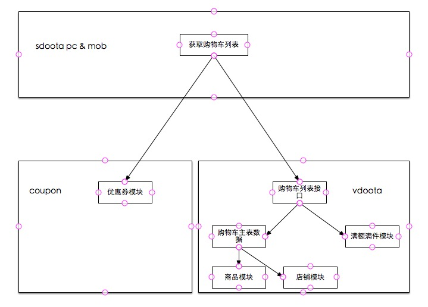
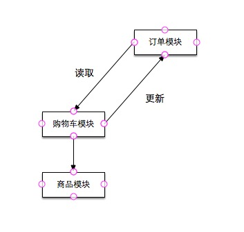
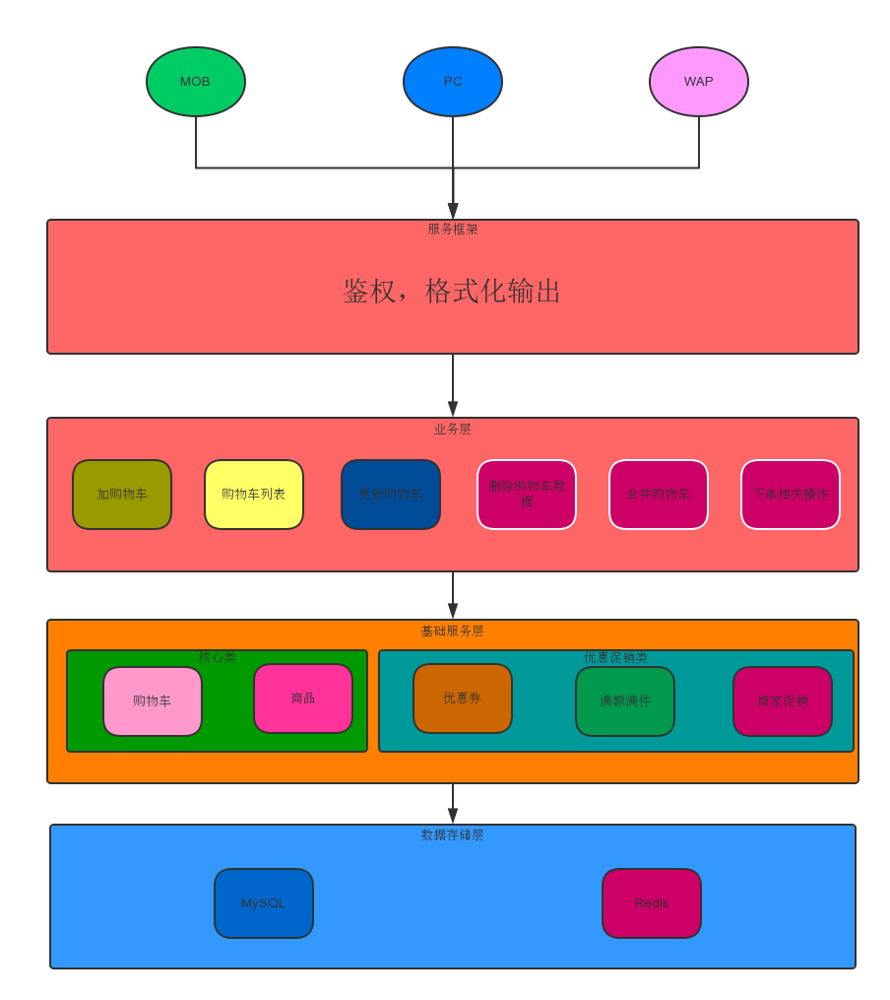
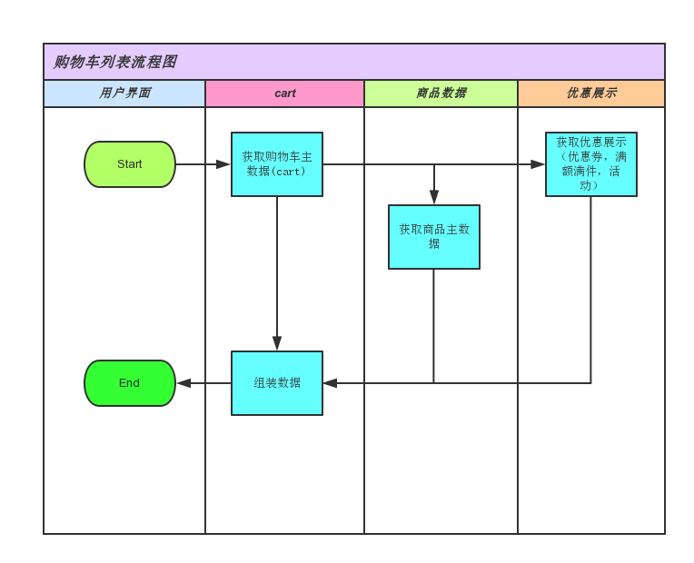
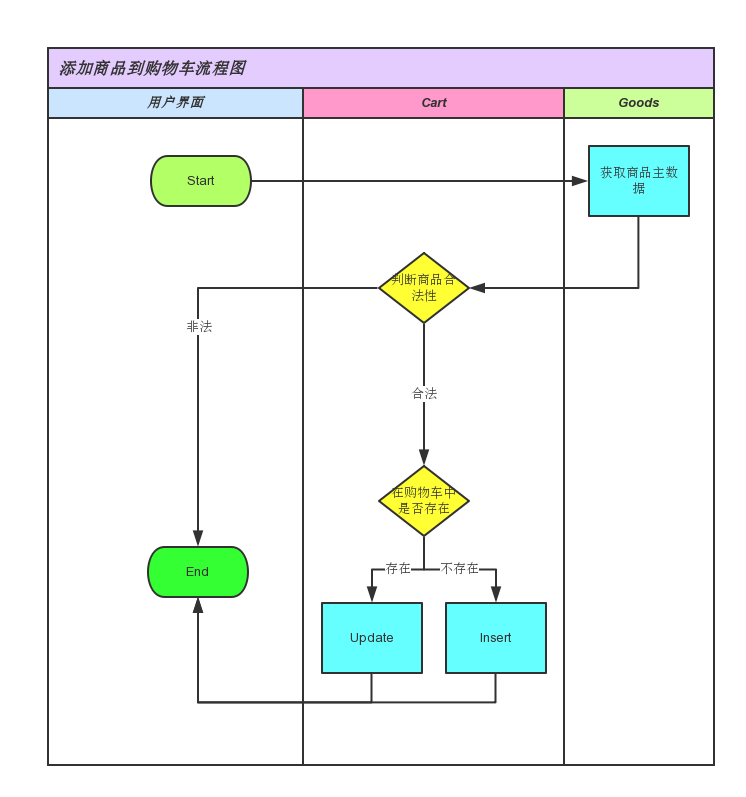
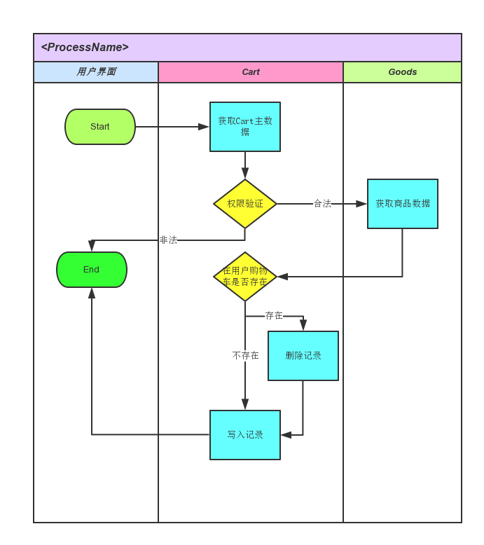

# 购物车前期调研

## 1，系统边界

从用户视角来看，购物车模块包括增删改查购物车记录。从功能视角来看，购物车模块是一个用户预购买商品的暂存地，整合了支撑交易功能的底层服务，服务包括商品，满额满件，优惠券。另外购物车还为下单提供了必要的数据。

## 2，依赖和被依赖关系

### 1,依赖
- **同商品的依赖关系**：购物车列表和商品的依赖是最紧密的，以至于在购物车的数据读取类里面直接嵌入了商品数据读取的代码。根据sku_id向商品模块读取sku的详细信息，包括价格，商品名称，库存等。

- **同满额满件的依赖关系**：加载完购物车的主信息（包括商品信息）后，会根据shop_id获取商家设置的满额满件的数据。

- **同优惠券的依赖关系**：根据用户id和购物车商品所属店铺id获取商家所设置的店铺优惠券数据。

- **同店铺的依赖关系**：根据shop_id获取店铺的详细数据。

### 2,被依赖
- **同下单的依赖关系**：购物车下单时会用到购物车的数据，购物车主表里面的每一条记录（以sid为主键的一条记录）表示一个sku，在订单确认页面或提交订单都会根据sid来获取商品的价格，库存，上下架等数据（实际上，会根据sid再去商品系统取一下数据）。下单完成后，系统会删除掉使用到的sid记录。

- **同登录的依赖关系**：用户登录时，会向购物车模块发送合并购物车请求。在登录请求的finally阶段，不会影响登录流程的进行。

- **同统计的依赖关系**：加车时，前端会传过来一个参数:pid，记录的是用户加车之前的动作，BI会异步读取分析数据来分析用户行为。

- **同消息推送的依赖关系**：一周前加入购物车的商品如果降价了，则推送消息

## 3,当前模块层次关系

> 整个交易系统的架构是两层结构(sdoota & vdoota), sdoota层的主要作用是发送请求和为各平台（pc & mob）组装数据，vdoota层的主要作用是处理各模块的逻辑和提供数据。

<center></center>
<center>图3-1：购物车列表层次结构图</center>
   
  
从购物车列表的层次图中可以看出，vdoota的购物车列表接囗调用了满额满件模块和购物车的主表数据，其中购物车的主表数据内嵌了商品数据的获取逻辑。另外一个和vdoota同层的coupon层提供了优惠券数据。


<center></center>
<center>图3-2：购物车下单层次结构图</center>

购物车下单的过程中，订单模块会向购物车获取获取下单商品的详细信息，下单成功后删除相应的购物车记录。

## 4,当前业务逻辑流程


- **购物车列表**：如果是已登录用户，从cart.t_bat_shopcart读取用户的购物车数据，未登录读取cart.t_bat_shopcart_offline，然后根据主表数据获取sku和shop的详细数据。遍历用户购物车的每条记录并格式化数据，sku中的数据包括了价格，库存，标题和活动的相关数据。购物车的主要数据加载完成后，根据shop_id获取商家设置的满额满件优惠数据。vdoota层处理完成，把这些数据返回给sdoota。sdoota接收到数据后，向coupon模块发送http请求获取店铺的可领取的店铺优惠券，格式化数据后向hornbill输出数据。(取满额满件，优惠券的具体逻辑todo)

- **向购物车添加商品**：系统首先加载添加商品的sku信息和用户所有的购物车数据，进行入库前的各项检查：上下架，商品属性（颜色尺码）合法性，库存，用户最多可加入的商品数等（相同商品一次只能有100件，购物车最多能有100种sku）。如果用户已经有相同sku商品，则更新amount，否则插入数据。

- **删除购物车商品**：根据sid（购物车每条记录主键）将对应的记录statu设置为-1。

- **更新购物车商品**：系统判断更新后的sku属性购物车里是否存在，如存在则删除更新的sku记录并返回，如不存在则更新相关的数据。

- **更新购物车sku数量**：更新购物车sku数量的参数是：sid_amount，amount是表示要更新到的sku数量，所以如果有两个客户端同时操作加或减，都会以最后执行操作所看到的那个结果为准。

- **获取优惠券提醒**：更新购物车商品和数量的时候，会调用获取购物车店铺优惠券的接囗。取到店铺优惠券数据后，过滤掉不满足条件的记录，组装数据后向hornbill输出数据。

- **订单确认**：购物车在订单确认所起的作用就是读取商品数据。

- **下单**：购物车在订单所起的作用除了读取商品数据外，在下单成功后还需要删除所对应的记录。

- **脚本推荐**： 一周前加入购物车的商品如果降价了，则推送消息

- **购物车合并**：用户未登录状态下向购物车加入的商品存放在cart.t_bat_shopcart_offline，用户登录后会把这个表里的数据同步到线上表cart.t_bat_shopcart。逻辑是遍历线下购物车，如有和线上sku数据相同的商品，则完全覆盖（sku数量以线下购物车数量为准）。合并完成后，删除线下数据库表的数据。

## 5,产品现状和规划(todo)

运营对购物车的要求是能灵活的控制购物车中商品的容量。产品对购物车的定位是暂存商品和促进交易。其中暂存交易包括了更方便的去修改购物车中商品的数量，属性等信息；促进交易主要包括购物车中的商品提供优惠券，满额满件的一些类似的优惠推荐。未来可能要加上商家的一些促销语，保障信息等能增加用户购买欲望的一些提示。产品对目前购物车优惠的建议是考虑到满件的优惠是可以选择商品的，希望为每一个商品出一份满额满件的优惠提示。
## 6,当前线上部署、流量、数据量和性能情况（含大促期间 todo）
- **1.当前线上部署情况**:
    nginx:
    		sdoota 
					pc:dfz-nx-01 dfz-nx-02
					mob:dfz-wannx-01 dfz-wannx-02
			vdoota
					dfz-nx-01 dfz-nx-02
		fast-cgi:nginx配置
			sdoota 
					pc:dfz-nx-01 dfz-nx-02
					mob:dfz-wannx-01 dfz-wannx-02

				    server 10.5.1.65:9996 weight=164 max_fails=3 fail_timeout=10s; #dfz-dootafe-04
					server 10.5.1.69:9996 weight=164 max_fails=3 fail_timeout=10s; #dfz-dootafe-05
					server 10.5.1.71:9996 weight=164 max_fails=3 fail_timeout=10s; #dfz-dootafe-06
					server 10.5.0.105:9996 weight=144 max_fails=3 fail_timeout=10s; #dfz-dootafe-07
					server 10.5.1.87:9996 weight=144 max_fails=3 fail_timeout=10s; #dfz-dootafe-08
					server 10.5.1.91:9996 weight=144 max_fails=3 fail_timeout=10s; #dfz-dootafe-09
					server 10.5.2.37:9996 weight=164 max_fails=3 fail_timeout=10s; #dfz-dootafe-10
					server 10.5.2.51:9996 weight=164 max_fails=3 fail_timeout=10s; #dfz-dootafe-11
					server 10.5.2.53:9996 weight=164 max_fails=3 fail_timeout=10s; #dfz-dootafe-12
					server 10.5.2.55:9996 weight=164 max_fails=3 fail_timeout=10s; #dfz-dootafe-13
					server 10.5.2.57:9996 weight=164 max_fails=3 fail_timeout=10s; #dfz-dootafe-14
					server 10.5.2.59:9996 weight=164 max_fails=3 fail_timeout=10s; #dfz-dootafe-15

			vdoota
					dfz-nx-01 dfz-nx-02

					server 10.5.2.61:9096 weight=164 max_fails=3 fail_timeout=10s; #dfz-dootafe-16
					server 10.5.2.63:9096 weight=164 max_fails=3 fail_timeout=10s; #dfz-dootafe-17
					server 10.5.2.65:9096 weight=144 max_fails=3 fail_timeout=10s; #dfz-dootafe-18
					server 10.5.5.27:9096 weight=164 max_fails=3 fail_timeout=10s; #dfz-dootafe-19
					server 10.5.5.37:9096 weight=164 max_fails=3 fail_timeout=10s; #dfz-dootafe-20
					server 10.5.5.41:9096 weight=164 max_fails=3 fail_timeout=10s; #dfz-dootafe-21
					server 10.5.5.43:9096 weight=164 max_fails=3 fail_timeout=10s; #dfz-dootafe-22
					server 10.5.3.35:9096 weight=164 max_fails=3 fail_timeout=10s; #dfz-dootafe-23
					server 10.5.3.37:9096 weight=164 max_fails=3 fail_timeout=10s; #dfz-dootafe-24
					server 10.5.3.39:9096 weight=164 max_fails=3 fail_timeout=10s; #dfz-dootafe-25
					server 10.5.3.43:9096 weight=164 max_fails=3 fail_timeout=10s; #dfz-dootafe-26
					server 10.5.3.45:9096 weight=164 max_fails=3 fail_timeout=10s; #dfz-dootafe-27
					server 10.5.1.15:9096 weight=164 max_fails=3 fail_timeout=10s; #dfz-dootafe-28
					server 10.5.1.18:9096 weight=164 max_fails=3 fail_timeout=10s; #dfz-dootafe-29
		db:
			db=cart host=10.5.1.33 port=3323 master=1
			db=cart host=10.5.1.37 port=3323 master=0
		    db=cart host=10.5.2.41 port=3323 master=0

- **流量：各接口（白天平均／高峰）的qps **:
    接口统计：
    	snake mob:
    		Cart_add    购物车添加商品
			Cart_list   购物车列表
			Cart_number 购物车商品数量
			Cart_remove 删除购物车商品
			Cart_statistic （已废弃，部分版本在用）
			Cart_update 更新购物车商品数量
		snake pc:
			Add 向购物车添加商品 dootaapi
			Add_result 加入购物车后的结果界面（取购物车数据）
			Batch_add  搭配秀商品添加到购物车
			Get_coupon_remind 更新购物车商品数量时调用的优惠券提醒（不过貌似不可用，待确认）
			Goods_prop 获取单品属性
			List_info  购物车列表
			Mz_check 判断加入购物车的商品是不是美妆特卖商品
			Number 购物车数量
			Remove 移除购物车商品
			Statistic 购物车数量统计（含海淘)
			Update 更新购物车数量
			Update_prop 更新购物车商品属性
			coupon/coupon_cart_promotion 商品加入购物车后界面的优惠券推荐
		vdoota:
			order/shopping_cart_add 添加购物车主接囗
			order/shopping_cart_add_multi 商品批量加入购物车（搭配购）
			order/shopping_cart_get 获取购物车特定记录数据
			order/addr_query 查询地址（mob计算包邮计算使用）
			order/shopping_cart_verify 验证用户购物车数据（get_coupon_remind使用）
			order/shopping_cart_banner 获取购物车banner
			order/shopping_cart_poster 获取购物车主数据（包括满额满件）
			order/shopping_cart_offshelf 已废弃
			order/mz_check 
			order/shopping_cart_number 获取购物车数量
			order/shopping_cart_remove 删除购物车商品
			order/shopping_cart_update 更新购物车数量
			order/shopping_cart_edit 更新购物车商品属性
			coupon/batch_get_shop_coupon_apply 批量获取店铺优惠券
			coupon/search_coupon get_coupon_remind使用
			coupon/batch_get_coupon_meta  get_coupon_remind使用
			freight/get_charge 获取运费
- **性能：各接口平均响应耗时，压测极限性能**:
	见pages附件
- **大促期间增长情况：515大促各接口流量增长**
	
- **耗时分布：耗时分层分布**
   
    ```
20点mob的购物车列表数据
    name:cart_list total_amount:37099 TotalAvgTime:0.308
	 0~50ms: 	 amount:2054	 avgTime:0.027
	 50~100ms: 	 amount:1039	 avgTime:0.089
	 100~150ms: 	 amount:7523	 avgTime:0.128
	 150~300ms: 	 amount:13734	 avgTime:0.211
	 300~500ms: 	 amount:6007	 avgTime:0.385
	 500~1000ms: 	 amount:6045	 avgTime:0.679
	>1000ms: 	 amount:697	 avgTime:1.42	

	同时间段优惠券接囗性能数据

	name:coupon_batch_get_shop_coupon_apply total_amount:36654 TotalAvgTime:0.053
	 0~50ms: 	 amount:23591	 avgTime:0.029
	 50~100ms: 	 amount:8051	 avgTime:0.071
	 100~150ms: 	 amount:3591	 avgTime:0.123
	 150~300ms: 	 amount:1418	 avgTime:0.176
	 300~500ms: 	 amount:3	 avgTime:0.388

	同时间段的virusdoota
	name:order_shopping_cart_poster total_amount:44245 TotalAvgTime:0.174
	 0~50ms: 	 amount:12952	 avgTime:0.029
	 50~100ms: 	 amount:10325	 avgTime:0.073
	 100~150ms: 	 amount:5366	 avgTime:0.123
	 150~300ms: 	 amount:7619	 avgTime:0.215
	 300~500ms: 	 amount:5250	 avgTime:0.396
	 500~1000ms: 	 amount:2256	 avgTime:0.625
	 >1000ms: 	 amount:477	 avgTime:1.696	
```

	通过在线上机器记录日志
	购物车列表一共有三个请求，统计数据发现购物车主信息（包括满额满件）占用了~60%，优惠券和运费的各占用了~20%。发现shopping_cart_poster数据主要消耗在商品信息的获取阶段（brd_goods）~80%

	```
	20点加购物车数据
	name:cart_add  total_amount:15279 TotalAvgTime:0.251
	 0~50ms: 	 amount:40	 avgTime:0.044
	 50~100ms: 	 amount:3899	 avgTime:0.078
	 100~150ms: 	 amount:2760	 avgTime:0.124
	 150~300ms: 	 amount:4132	 avgTime:0.214
	 300~500ms: 	 amount:2708	 avgTime:0.391
	 500~1000ms: 	 amount:1540	 avgTime:0.664
	 >1000ms: 	 amount:200	 avgTime:1.1

	对应同时间段的virusdoota

	name:order_shopping_cart_add  total_amount:29086 TotalAvgTime:0.212
	 0~50ms: 	 amount:2590	 avgTime:0.042
	 50~100ms: 	 amount:9670	 avgTime:0.07
	 100~150ms: 	 amount:3979	 avgTime:0.124
	 150~300ms: 	 amount:6037	 avgTime:0.215
	 300~500ms: 	 amount:4189	 avgTime:0.39
	 500~1000ms: 	 amount:2281	 avgTime:0.662
	 >1000ms: 	 amount:340	 avgTime:1.364

	```
	添加购物车里面有判断购物车是否存在这个sku的判断，里面取了用户所有的购物车数据，看逻辑里面遍历的调用了商品库，导致耗时较长，~85%

- **线上系统数据量和数据增长情况：子系统相关数据库每天增量**:

  新增数据量: 
	- 5-28号 t_bat_shopcart： 789556。  t_bat_shopcart_offline：94789（会有物理删除）（nginx大概90w次加车请求）
    - 5-15号（大促）t_bat_shopcart: 3900000 t_bat_shopcart_offline:1089766（会有物理删除） (nginx有大概600w次加车请求)

  总数据量：t_bat_shopcart 249642294。t_bat_shopcart_offline 48504757


# 购物车设计

## 1,系统边界

购物车承载了两个功能点，一是用户商品的暂存，二是在暂存商品的基础上促进用户的消费（包括优惠券等优惠条件的提示）。在这两个功能点上明确我们的系统主要处理暂存商品的CRUD，和在这个商品上的优惠推荐。优惠推荐包括优惠券，满额满件这两个重要部分。

## 2，业务模型设计

<center></center>
<center>图3-1：购物车系统总体架构模型</center>

先说线上购物车系统的痛点：

- **功能升级困难易出错**
- **获取商品信息耗时高，导致多个接囗性能低下**
- **核心数据非核心数据不做区分，大促业务降级不好做**

追根溯源，上面这些问题的出现主要就是系统模块间边界不清晰，系统代码杂糅在一起，比较有代表性的就是商品信息里面混入了商家活动的数据，商品信息更是直接嵌入了Cart的数据层（相当于商品就是购物车的一部分）,当初这样设计的初衷是在引入sku的时候，减少了很大部分的工作量，缺点就是商家活动部分也在这个接囗里面提供，这算是一个经常发生变动的地方，这样就导致了本是应该保持稳定的Cart类经常的要做改动。

鉴于上面出现的问题，把购物车分为两个大部分，其中的核心是数据的暂存功能，这部分正常工作不会影响用户交易的正常流程，相对次要功能是优惠的展示，这部分的产品思想是要促进交易的进行，但是它本质上属于非核心的数据，出现问题也不会波及到主站的交易进行。从代码结构上把它们拆分开使整个系统的结构更加清晰，对任何的子模块都可以实现功能的插拔，在系统压力较大的时候可以对这些功能选择性的降级。这样设计后我们基本实现了保证高可用和可用，非核心和核心，频繁改动和基本不改动的区分。
   
- **系统解耦合**：把一个大系统拆分成小的子模块，子模块定义清晰的I/O，这个对外要保持相对稳定，尽量不要依赖于其他的模块，一名话就是要“小而美”。对外可提供http或方法调用来被调用。我们把这些小模块称之为“通用业务层”。
- **可灵活插拔功能的实现**：这个主要是针对非核心数据来说的。在业务层（“通用业务层”的上一层）上加入一个配置小模块，对某些务件下可以过滤掉某些请求。获取数据后的数据组合阶段要分开，避免杂糅到一起造成以为维护的不便。
- **子模块发生变化的考虑**：这种需求在我们系统的现阶段还是比较容易出现，比如商品，不管它是来自于C店，来自于Higo，为它们定义一个抽象类，这些商品都有一些共同的属性和方法，具体内部逻辑的不同在各子类中处理，使用商品的部分不用了解各商品的不同。
- **存储介质扩展性的考虑**：获取数据上方加和一层adapter对数据做适配，上层只需要获取数据，而不用考虑数据使用什么存储。短期内DB不会成为瓶颈，还是继续保持以MySQL作为数据存储，但对表里没有用处的字段可以不再处理（color, size等）。
- **对老版本的支持**：由于mob老版本的存在，我们开发新的接囗，保持目前接囗的可用性。
- **购物车存储字段**: user_id，sku_id, amount。这三个字段是实现购物车最核心字段，因为具体功能的实现，折衷加入了price,source（加车来源）。目前表里存在的字段如color，size，offline_sid，理论上都应该去掉。因为BI加入的pid考虑用其他的方式实现统计需求（如使用消息队列）。
   
## 3,子系统内部拆分原则和详述

<center></center>
<center>图3-1：购物车列表流程图</center>
   
上图描述了购物车列表获取数据的流程，首先根据用户ID获取购物车的主数据（目前100条，可灵活调整），获取到购物车数据的sku，shop_id，goods_id并发的向商品模块获取商品的详细信息，向优惠模块获取商品所对应的优惠信息，拿到数据后根据各平台的格式规定组装数据返回给前端。
    

<center></center>
<center>图3-2：添加商品到购物车流程图</center>

上图描述的加车的流程，根据sku_id获取商品数据，判断商品是否可以加入购物车（上下架，库存，购物车容量等）。如是是合法数据，判断sku在购物车中是否存在。存在的话，直接更新购物车sku数量，否则写入cart表。

<center></center>
<center>图3-3：更新购物车流程图</center>


## 4,对外接囗设计

- 购物车列表：用户购物车商品信息，商家设置的活动信息，店铺优惠券推荐，满额满件优惠提示。

- 更新，删除，增加：返回success或错误信息。

## 5,流量和性能要求

调研阶段的结论显示购物车的性能主要依赖于商品优惠券等子模块的性能。预估优化合理，购物车列表性能在50ms左右。

## 6,数据层方案（schema，分库分表策略，主从同步要求等）

## 7，迁移方案、部署方案


